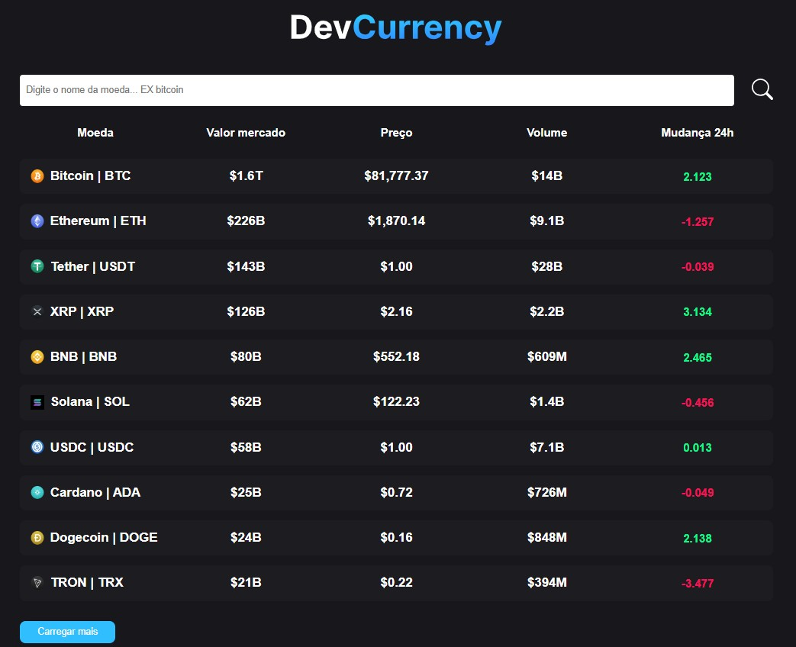

<h1 align="center">
    CriptoMoedas
</h1>

<h1 align="center">
  
</h1>

<h3 align="center">
  <a href="https://cripto-ju.netlify.app/" target="_blank">Access demo page</a>
<h3 >

# Index

- [About](#-about)
- [Technologies used](#-technologies-used)
- [How to install and run the project](#-how-to-install-and-run-the-project)

## 🔖&nbsp; About

This project provides a comprehensive listing of cryptocurrencies, allowing users to view a list of the top cryptocurrencies with relevant data, such as price, market cap, and volume. Additionally, each cryptocurrency has a dedicated detail page, where users can access more in-depth information, including historical data and price changes.

---

## 🚀 Technologies used

The project was developed using the following technologies

- CSS Modules
- TypeScript
- ReactJS
- CoinCap API (for fetching cryptocurrency data)

---

## 🗂 How to install and run the project

    - Clone the repository
    - Enter directory
    - Install dependencies - run 'npm install'
    - Start project - run 'npm run dev'
   
---

Developed ❤ by Juliana Fernandez